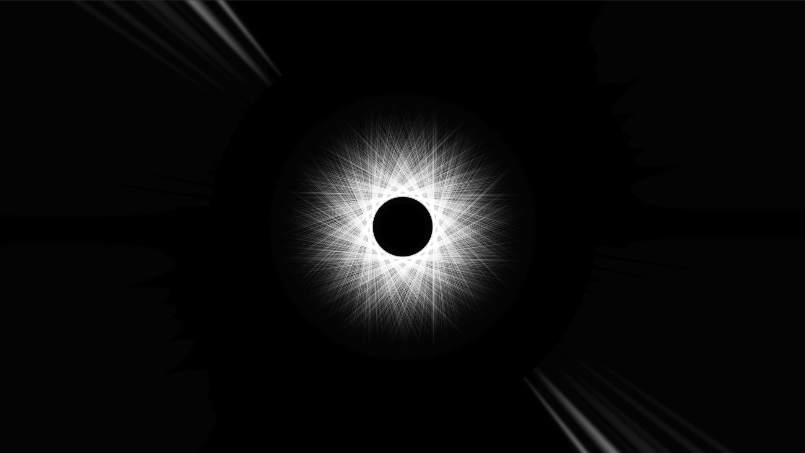

# Introduction

This project uses a FFT to analyze Josha Sabin's track "U12" from the 
album Terminus Drift. I'm using three different shaders – one for the 
circle in the center, one for the blurry spikes on the sides and one to 
draw a half-transparent background that creates traces of the other two 
elements from earlier in the song. Here is a picture:

# How to use

You will need openFrameworks to run this visualization but no addons are 
necessary. Simply put it in a subfolder of `apps` or wherever you have 
configured the projectGenerator to look for projects, run 
openFramework's projectGenerator, run `make`, and do `make run`. 
Alternatively, use QTCreator's openFramework's [Qt Creator 
plugin](https://openframeworks.cc/setup/qtcreator/).

You start the music with the space key, and jump 15 seconds forward or 
backward with <kbd>→</kbd> and <kbd>←</kbd>. <kbd>s</kbd> stops the song 
and <kbd>f</kbd> toggles fullscreen.

# Licence

This projected is licenced under GPLv3.
